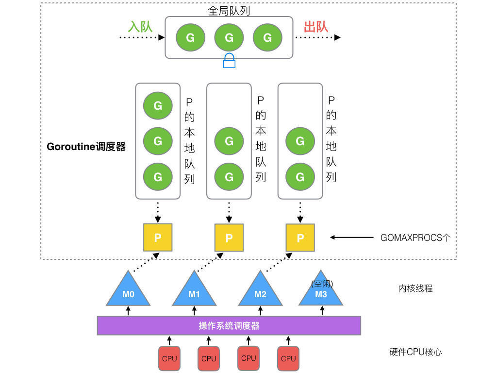

# goroutine的调度
goroutine来自协程（用户态线程，co-routine）的概念，让`一组可复用的函数运行在一组线程之上`，即使有协程阻塞，改线程的其他协程也可以被`runtime`调度以转移到其他可运行的线程之上。

Go的goroutine调度器（Scheduler）简单来说存在几个版本，不过大致可以理解版本的迭代为GMP模型的逐渐完善。`G就是goroutine`；`M表示工作线程`，或者机器machine，这个缩写也是来源于此；`P是处理器processor，逻辑CPU`。

在目前应用了GMP模型思想的调度器诞生之前，老版本的调度器是只有GM两种元素。众多G被放在了同一个全局G队列，每个M都需要访问这个队列来执行或者放回一个G，自然地，多线程访问同一资源需要通过加锁来保证互斥访问。这样，GM模型的调度器存在几个明显缺点：
- 每个M在创建、销毁、调度一个G时都要获取锁，这就形成了激烈的锁竞争。
- 两个M在移交G时会造成延迟和额外的系统负载。例如某个G包含再起一个新的G'的逻辑时，相应的M会创建G'，但是为了继续执行G，M需要把这个新的G'移交给另一个M'去执行。（这会造成很差的局部性）
- CPU在不同的M之间的切换的系统调用会导致频繁的线程阻塞和取消阻塞，这些操作都增加了系统开销。

在目前使用的调度器中，新的元素P得以引入。P包含了运行goroutine的资源和可运行的G的队列。所以一个M要想运行一个G，必须先获取P。

对上图的内容进行简要说明：
- 全局队列：等待执行的G的队列。
- P的本地队列：同样存放等待执行的G，但是不超过256个。上文中提到的被这里的某个G新建的G'会优先加入这个队列。如果队列满了，就把本地队列的一半的G移动到全局队列。
- P：所有的P都在程序启动时创建，存放在数组中，最多`GOMAXPROCS`个。那么也就意味着最多`GOMAXPROCS`个goroutine在同时执行。又因为一个M需要拿到一个P才能去执行G，那么也就意味着最多`GOMAXPROCS`个M在并行。
  >`GOMAXPROCS`可以从环境变量`$GOMAXPROCS`获取，也可以从runtime的方法`GOMAXPROCS()`来决定。
- M：M想运行G就先获取一个P，从P的本地队列获取G。如果P的本地队列是空的，M也会从全局队列拿一批G放到P的本地队列，或者从其他P的本地队列拿一半（work stealing机制）放到自己的P的本地队列。

## M和P的数量
goroutine 调度器和OS调度器是通过M联系起来的，一个M就是一个内核线程，OS调度器负责把内核线程分配到CPU上去执行。

Go程序启动时会设置M的最大数量，但是这个数量默认10000，内核很难支持这么多的线程数，所以这个限制可以忽略。`runtime/debug`包中的`SetMaxThreads`函数可以设置M的数量。一个M被阻塞了，P就会创建新的M或者切换M。所以M和P的数量没有绝对关系。

## M和P的创建时机
P：P的最大数量n被确认后，runtime会创建n个P
M：在没有足够数量的M来关联P去运行G时，M就会被创建。

## goroutine调度器的设计策略
- **复用线程**：避免频繁的创建、销毁线程，转而是对创建的线程进行复用。包括前文提到的work stealing机制；hand off机制：当本M因为G产生了系统调用而阻塞时，M释放自己的P，把P转移给其他空闲的M。
- **利用并行**：在对GMP模型的示意图的P的解释已经提过了。`GOMAXPROCS`不仅是设置P的数量，也限制了并发的程度。
- **抢占**：协程（coroutine）是需要一个协程主动让出CPU才执行下一个协程，但是一个G最多占用CPU 10ms，以防止其他G被饿死。
- **全局G队列**：现在的调度器仍然有全局G队列，但是相比被弃用的老版本的调度器，它被弱化了。因为work stealing机制允许M从其他P偷未执行的G。

## go func()的调度流程示意图
scheduleprocess.png)