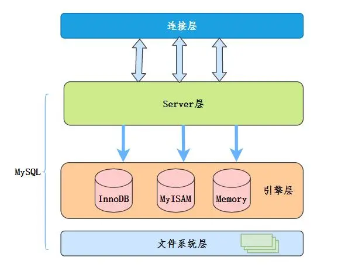

# 主键（primary key）和唯一索引(unique index)的区别是什么？
主键一定是唯一索引，但是唯一索引不一定就是主键。
主键是能够标识表中某一行的属性或者属性组，一张表只能有一个主键，但是可以有多个唯一索引。
主键列不允许空值，而唯一索引列允许列空值。
唯一索引是索引，索引可以提高查询速度。主键是逻辑键；索引是物理键，会占用索引页并被保存在磁盘上。

# 索引下推（Index Condition Pushdown）

MySQL是分层的。所谓的“下推”指的是把上层的事情交给下层来做。

在MySQL5.6之前，使用非主键索引进行查询的时候，Server层负责语法解析、生成执行计划等。并调用存储引擎层取执行数据的存储和检索。