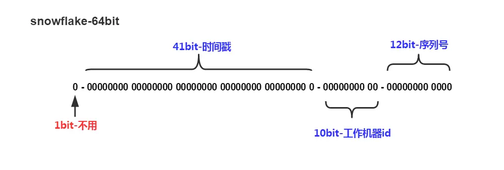

这部分的大部分内容来自于[路人张的面试笔记](https://www.mianshi.online/distributed-id.html)
# 如何设计一个分布式ID生成器？
需求：
设计一个分布式ID生成器(Distributed ID Generator)，并保证ID按时间粗略有序。

应用场景(Scenario)：
现实中很多业务都有生成唯一ID的需求，例如：
- 用户ID
- 微博ID
- 聊天消息ID
- 帖子ID
- 订单ID需求(Needs)

这个ID往往会作为数据库主键，所以需要保证全局唯一。数据库会在这个字段上建立聚集索引(Clustered Index，参考 MySQL InnoDB)，即该字段会影响各条数据再物理存储上的顺序。 ID还要尽可能短，节省内存，让数据库索引效率更高。基本上64位整数能够满足绝大多数的场景，但是如果能做到比64位更短那就更好了。

核心需求：
- 全局唯一
- 按照时间粗略有序
- 尽可能短

### 方案：
**1.UUID**

用12字节的UUID来解决：
- 4个字节表示unix timestamp
- 3个字节表示机器ID（分布式）
- 2个字节表示进程ID
- 3个字节表示计数器

缺点：太长；索引查询效率低。

**2.多台MySQL服务器**

MySQL可以产生自增ID。

假设8台MySQL服务器协同工作，每台机的ID的初始值不同。例如第一台是1，第二台是2，以此类推，每次递增一个定值，比如8。在它们之前用一个负载均衡器（原文用的时间片轮转负载均衡器round-robin load balancer）对到来的请求随机地分配给这8台机中的一个，然后返回与1个ID。

不过既然每台机不用作数据存储，那么就不需要记录每次生成的ID，只需要存自己生成的ID的最大值。（每次用MySQL的replace into来更新）

缺点：ID不是严格递增。但是需求只要求粗略递增。

**3.Snowflake**
Twitter有个成熟的开源项目叫Twitter Snowflake，专门用于生成ID。每个ID占64位。

- 第一位 占用1bit，其值始终是0，没有实际作用。 
- 时间戳 占用41bit，精确到毫秒，总共可以容纳约69年的时间。 
- 工作机器id 占用10bit，其中高位5bit是数据中心ID，低位5bit是工作节点ID，做多可以容纳1024个节点。 
- 序列号 占用12bit，每个节点每毫秒0开始不断累加，最多可以累加到4095，一共可以产生4096个ID。

那么Snowflake在同一毫秒内最多可以生成1024*4096个全局唯一ID。（估计一下需求的大概的数据量的数量级，发现绝对够用了）

在实现层面，有这么几个要点:
- 设计：由于目前很多公司都是分数据中心的，那么10位的工作机器ID可以设计成5位的数据中心ID+5位此数据中心的工作机器ID。
- 要确保在生成时通过加锁保证并发安全。（不要让两个进程在生成时拿到重复的时间戳）
- 考虑到生成程序的执行时间可能很短...所以得判断当前拿到的时间戳确实比上一次拿到的大，否则就重复了。
- 但是如果当前毫秒生成的ID溢出了，再等一下一毫秒再生成。

[别人的实现](https://cloud.tencent.com/developer/article/1820225)